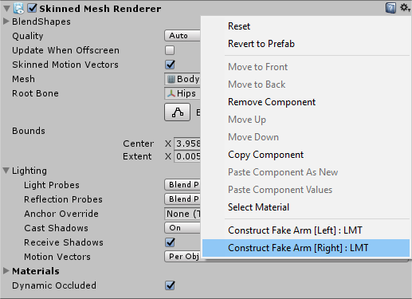

# Conversion guide

You have a custom avatar and you want to dance with someone who also has a custom avatar?

Each of you will need to create a new, custom avatar that has been modified to use the *Handholding Shader IK* (**HSIK**). It may be difficult depending on your experience.

## How will the avatars work in VRChat?

When inside VRChat, one of the dancers is able to become the *"follower"* by making a hand gesture like *Rock and Roll*. They will lend their right hand to the *"leader"* .

The dancer who is lending their hand will lose control of their real arm, and a fake arm will follow the movement of the other avatar's left hand.

In terms of dancing, the *"leader"* has the most freedom while dancing, as their movement will not feel constrained by the *"follower"*.

The two dancers can alternatively become *"leader"* and *"follower"* by making the gesture. When both dancers are making the gesture, then both hands of both avatars will be handholding, each dancer being in control of the other dancer's right hand. 

## How does the shader look like?

This shader only contains an IK system. This system is meant to be inserted within an existing aesthetic shader such as *Poiyomi Toon Shader*, *Silent's Cel Shading Shader*...

In order for your avatar to keep its aesthetic, you need to create a copy of the aesthetic shader of your choice, and integrate *HSIK* with it. This may be difficult depending on your shader experience.

For now, **we provide a simple unlit shader** that will look okay in some worlds.

In the future we may provide existing shaders that have been modified for use with *HSIK*.

If you are up for the task, read our [Advanced shader guide](GUIDE_advanced.md).

## How can I convert my avatar?

If not already done, reduce the avatar to use a few materials and ideally one mesh. Having many materials and meshes will make the job extremely difficult.

This repository has an example scene located in `Assets/ExampleModel/ExampleModelScene.unity` that you can use as a reference, and try the Editor Script conversion tool. There is another example scene located in `Assets/Possum/PossumScene.unity`.

First of all, create a copy of the avatar and make backups.

All of our examples will convert the **right** arm, therefore the guide will be written with the right arm in mind.

#### Make the real arm invisible

Before creating the fake arm, we need to create a material to make the right arm invisible when the fake arm is visible.

We will use `Assets/UnlitHideArmShader.shader` as part of this guide. Create a material with that shader, set a texture, and apply that material to your body.

If your body has multiple materials, create as many materials as there are different materials on your right arm and apply them.

On the material, keep the `Enable fake arm` setting to `1` for the time being.

#### Generate new meshes with the Editor Script

On your avatar's body, open the cog menu next to the Skinned Mesh Renderer. Use the script `Construct Fake Arm [Right] : LMT`. 

This will generate two new meshes in the `Assets/Generated` folder which you can move to another location.

After generating, the avatar's right arm should now be invisible.

#### Apply the material to the fake arm

In order to make the avatar look nice even if shaders are turned off in the safety settings, the fake arm mesh is very small.

When shaders are turned on, the shader will scale the fake arm mesh to make it visible. Let's apply that shader on the fake arm.

*The guide is currently incomplete, check back soon.*

*For the time being you may open the example scene `Assets/ExampleModel/ExampleModelScene.unity` for guidance.*

#### Add a light to the other arm's wrist

*The guide is currently incomplete, check back soon.*

*For the time being you may open the example scene `Assets/ExampleModel/ExampleModelScene.unity` for guidance.*

#### Add a gesture animation to enable or disable the fake arm

*The guide is currently incomplete, check back soon.*

*For the time being you may open the example scene `Assets/ExampleModel/ExampleModelScene.unity` for guidance.*
